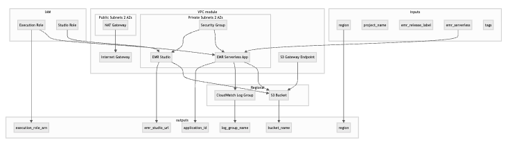

# zero-to-emr-serverless

This repository is **support material** for my article and blog. It provides the Terraform code and documentation to go from zero to a working **AWS EMR Serverless** setup. For more content on cloud, DevOps, and infrastructure, visit **[benlabs.dev](https://benlabs.dev/)**.

---

## Overview

Terraform-based stack that provisions a production-ready **EMR Serverless** environment on AWS: VPC with public/private subnets, an EMR Serverless Spark application, **EMR Studio** for interactive development, S3 storage, CloudWatch logging, and the required IAM roles—all in one apply.

---

## Architecture

*VPC with public/private subnets, EMR Serverless App and EMR Studio in private subnets, IAM roles, S3 bucket, CloudWatch log group, and S3 Gateway Endpoint.*

---

### Main resources at a glance

- **Networking:** VPC (10.100.0.0/16), 2 AZs, public + private subnets, NAT gateway, S3 Gateway Endpoint.
- **Storage & logging:** One S3 bucket (project-scoped name), one CloudWatch log group (7-day retention).
- **Security:** One security group (egress-only) for both EMR Serverless and EMR Studio.
- **IAM:** Execution role for EMR Serverless (S3, VPC ENI, CloudWatch); Studio role with EMR Editors, S3, and EMR full access (as in the article).
- **EMR:** One EMR Serverless Spark application (configurable driver/executor and max capacity) and one EMR Studio workspace pointing at the bucket.

---

## Quick start

1. Copy `examples/terraform.tfvars.example` to `terraform/terraform.tfvars` and set your `region`, `project_name`, and optionally adjust `emr_serverless` and `tags`.
2. Optionally configure a remote Terraform backend (for example S3 + DynamoDB) in `terraform/terraform.tf` for your account and team workflow.
3. From the `terraform/` directory: run `terraform init`, then `terraform plan` and `terraform apply`.

After apply, use the outputs `emr_studio_url`, `application_id`, and `execution_role_arn` to run jobs (e.g. via SDK or CLI) or open EMR Studio.

---

*Supporting repo for [benlabs.dev](https://benlabs.dev/) — blog and articles on DevOps, AWS, and cloud architecture.*
